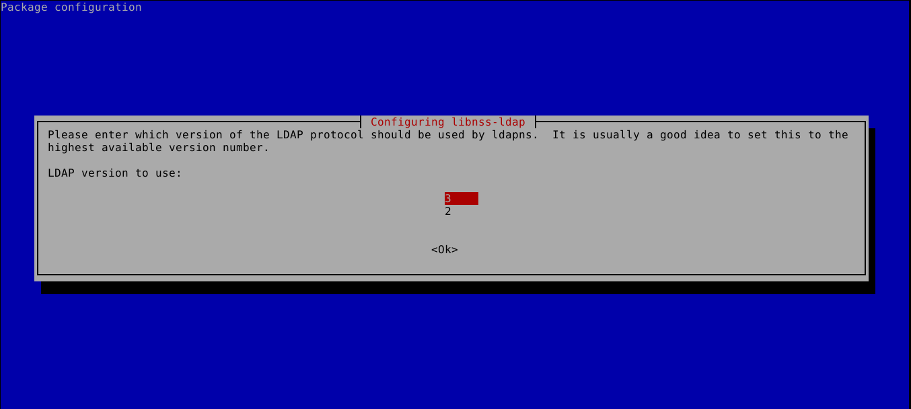

# Instalación y configuración inicial de OpenLDAP

## Realiza la instalación y configuración básica de OpenLDAP en alfa, utilizando como base el nombre DNS asignado. Deberás crear un usuario llamado prueba y configurar una máquina cliente basada en Ubuntu y Rocky para que pueda validarse en servidor ldap configurado anteriormente con el usuario prueba.

### 1. Instalación y configuración de OpenLDAP en el Servidor

El FQDN  de mi alfa es este:
```bash
hostname -f 
alfa.ivan.gonzalonazareno.org
```

Como vemos, el FQDN está configurado correctamente. Con esto, ya podemos instalar OpenLDAP en nuestra máquina servidora:
```bash
apt install slapd
```
Durante la instalación nos pedirá la contraseña que usará el usuario administrador de LDAP, en mi caso la he puesto como “root”:

Una vez instalado, podemos comprobar que nos ha abierto el puerto TCP 389, que es por el que estará escuchando las peticiones:
```bash
netstat -tlnp | egrep slap
```


Ahora que hemos comprobado que ldap está activo y funcionando, procedemos a instalar el paquete de herramientas con las que trabajaremos:
```bash
apt install ldap-utils
```

Ahora ya podemos usar el comando ldapsearch con las credenciales que introducimos durante la instalación (si queremos hacer la búsqueda como administrador) para buscar el contenido que tenemos en nuestro directorio:
```bash
ldapsearch -x -D "cn=admin,dc=ivan,dc=gonzalonazareno,dc=org" -b "dc=ivan,dc=gonzalonazareno,dc=org" -W
```


Con esto hemos finalizado la instalación de LDAP, pero para tener una mayor organización de los objetos que creemos, vamos a crear un par de objetos llamados unidades organizativas. Para ello vamos a crear un fichero .ldif con la siguiente información:
```bash
nano UnidadesOrganizativas.ldif
```
```ldif
dn: ou=Personas,dc=ivan,dc=gonzalonazareno,dc=org
objectClass: top
objectClass: organizationalUnit
ou: Personas
 
dn: ou=Grupos,dc=ivan,dc=gonzalonazareno,dc=org
objectClass: top
objectClass: organizationalUnit
ou: Grupos
```

Una vez que ya tenemos ese fichero listo, podemos incluirlo a nuestro directorio con el siguiente comando:
```bash
ldapadd -x -D "cn=admin,dc=ivan,dc=gonzalonazareno,dc=org" -f UnidadesOrganizativas.ldif -W
```

Para borrar las unidades organizativas, usaremos el siguiente comando:
```bash
ldapdelete -x -D 'cn=admin,dc=ivan,dc=gonzalonazareno,dc=org' -W ou=People,dc=ivan,dc=gonzalonazareno,dc=org
ldapdelete -x -D 'cn=admin,dc=ivan,dc=gonzalonazareno,dc=org' -W ou=Group,dc=ivan,dc=gonzalonazareno,dc=org
```

Podemos comprobar que, efectivamente, se han producido los cambios:
```bash
ldapsearch -x -b dc=ivan,dc=gonzalonazareno,dc=org
```


También crearemos un grupo llamado prueba:
```bash
nano grupos.ldif
```
```ldif
dn: cn=prueba,ou=Grupos,dc=ivan,dc=gonzalonazareno,dc=org
objectClass: top
objectClass: posixGroup
gidNumber: 2001
cn: prueba
```

Una vez que ya tenemos el fichero, lo añadiremos a nuestro directorio:
```bash
ldapadd -x -D 'cn=admin,dc=ivan,dc=gonzalonazareno,dc=org' -W -f grupos.ldif
```
Como podemos ver, se ha creado correctamente:
```bash
ldapsearch -x -b dc=ivan,dc=gonzalonazareno,dc=org
```


Para borrarlo, usaremos el siguiente comando:
```bash
ldapdelete -x -D 'cn=admin,dc=ivan,dc=gonzalonazareno,dc=org' -W cn=prueba,ou=Group,dc=ivan,dc=gonzalonazareno,dc=org
```

Crearemos una contraseña cifrada para el usuario prueba (es necesario cifrar la contraseña del usuario con el comando slappasswd que generará un resultado a pegar en el campo userPassword.):
```bash
slappasswd
```


Tras esto, crearé un usuario llamado prueba:
```bash
nano usuarios.ldif
```
```ldif
dn: uid=prueba,ou=Personas,dc=ivan,dc=gonzalonazareno,dc=org
objectClass: top
objectClass: posixAccount
objectClass: inetOrgPerson
objectClass: person
cn: prueba
uid: prueba
uidNumber: 2001
gidNumber: 2001
homeDirectory: /home/nfs/prueba
loginShell: /bin/bash
userPassword: {SSHA}b6NHN7nGbi69nn28rinOBFnQrI1xrAwM
sn: prueba
mail: prueba@gmail.com
givenName: prueba
```

Una vez que ya tenemos el fichero, lo añadiremos a nuestro directorio:
```bash
ldapadd -x -D 'cn=admin,dc=ivan,dc=gonzalonazareno,dc=org' -W -f usuarios.ldif
```

Podemos comprobar que se ha añadido el usuario prueba al grupo prueba:
```bash
ldapsearch -x -b dc=ivan,dc=gonzalonazareno,dc=org
```


Para borrar el usuario prueba, usaremos el siguiente comando:
```bash
ldapdelete -x -D 'cn=admin,dc=ivan,dc=gonzalonazareno,dc=org' -W uid=prueba,ou=People,dc=ivan,dc=gonzalonazareno,dc=org
```

### 2. Configuración de NFS en el Servidor

El usuario no podrá acceder a su cuenta, ya que no tiene un directorio de inicio. Para crearlo, ejecutaremos el siguiente comando:
```bash
mkdir /home/nfs
mkdir /home/nfs/prueba
chown 2001:2001 /home/nfs/prueba
```

Ahora, vamos a modificar el fichero /etc/exports para que el usuario prueba pueda acceder a su directorio de inicio:
```bash
nano /etc/exports
```
```bash
/home/nfs       *(rw,fsid=0,subtree_check)
```

Una vez que ya tenemos el fichero modificado, reiniciaremos el servicio nfs-kernel-server:
```bash
/etc/init.d/nfs-kernel-server restart
```

## 3. Instalación Name Service Switch (NSS), Pluggable Authentication Module (PAM) y Name Service Cache Daemon (NSCD) en el Servidor

En el servidor LDAP, instalamos los distintos paquetes que permiten que el sistema sea capaz de resolver nombres de usuarios (UID) y grupos (GID), consultar información a un directorio LDAP, identificarse o cachear la resolución de nombres. 

```bash
apt-get install libpam-ldapd nscd libnss-ldap
```

Lo configuramos en mi caso de la siguiente forma:





Y por último, modificamos el fichero /etc/nsswitch.conf para que el sistema utilice el servicio LDAP para la resolución de nombres:
```bash
nano /etc/nsswitch.conf
```


Veremos el uuid del usuario prueba:
```bash
id prueba
```


Para terminar, nos loguearemos con el usuario prueba:
```bash
login prueba
```


### 4. Configuración del Cliente Ubuntu

Para configurar el cliente Ubuntu, primero debemos instalar el paquete de herramientas de ldap:
```bash
apt install ldap-utils
```

Ahora, vamos a crear un fichero de configuración para el cliente:
```bash
nano /etc/ldap/ldap.conf
```
```bash
BASE dc=ivan,dc=gonzalonazareno,dc=org
URI ldap://alfa.ivan.gonzalonazareno.org
```

Una vez que ya tenemos el fichero de configuración, podemos comprobar que funciona correctamente:
```bash
ldapsearch -x -b "dc=ivan,dc=gonzalonazareno,dc=org"
```


Como podemos ver, funciona correctamente.

Ahora vamos a comprobar que funciona correctamente desde el cliente Ubuntu. Para ello, usaremos el siguiente comando para conectarnos al servidor LDAP con el usuario prueba y verificar la autentificación:
```bash
ldapwhoami -x -D "uid=prueba,ou=Personas,dc=ivan,dc=gonzalonazareno,dc=org" -W
```


Instalamos los paquetes necesarios (libnss-ldap, libpam-ldapd y nscd):
```bash
apt install -y libnss-ldap libpam-ldapd nscd
```
Lo vamos configurar como en el servidor, pero esta vez los datos introducidos serán los del servidor LDAP y no los del host local (en este caso el cliente Ubuntu).    

Ahora, vamos a modificar el fichero /etc/nsswitch.conf para que el sistema utilice el servicio LDAP para la resolución de nombres:
```bash
nano /etc/nsswitch.conf
```


Tras esto, si ejecutamos se reiniciará el servicio nscd y ya podremos acceder al servidor LDAP desde el cliente Ubuntu con login:
```bash
service nscd restart
```

Sin embargo, no podremos acceder a la carpeta de inicio del usuario prueba, ya que no está montada. Para ello, vamos a montarla mediante NFS.

Instalamos el paquete para el cliente NFS:
```bash
apt install -y nfs-common
```
Activamos el servicio:
```bash
systemctl start nfs-client.target & systemctl enable nfs-client.target
```
Creamos el directorio de montaje:
```bash
mkdir /home/nfs
mkdir /home/nfs/prueba
chown 2001:2001 /home/nfs/prueba
```

A partir de aquí podriamos acceder a la carpeta de inicio del usuario prueba, pero si crearamos un directorio nuevo en la carpeta de inicio del usuario prueba, no se vería reflejado en el servidor. Esto es un gran problema ya que si nos conectamos desde otro cliente, no veremos los cambios que hayamos hecho en la carpeta de inicio del usuario prueba.
Para solucionar esto, vamos a montar la carpeta de inicio del usuario prueba mediante NFS.

Cargamos el módulo:
```bash
modprobe nfs
```

Ejecutamos lo siguiente para que se cargue el modulo automáticamente:
```bash
echo NFS | tee -a /etc/modules
```
Lo montamos mediante systemd:
```bash
nano /etc/systemd/system/home-nfs.mount
```
Añadimos las siguientes líneas:
```bash
[Unit]
Description=script de montaje NFS
Requires=network-online.target
After=network-online.target
[Mount]
What=192.168.0.1:/home/nfs
Where=/home/nfs
Options=_netdev,auto
Type=nfs
[Install]
WantedBy=multi-user.target
```
Reiniciamos el servicio:
```bash
systemctl daemon-reload
systemctl start home-nfs.mount
systemctl enable home-nfs.mount
```


Vamos a comprobar que funciona correctamente:
```bash
login prueba
```


Para finalizar, vamos a comprobar que desde el servidor se ven los cambios que hagamos en la carpeta de inicio del usuario prueba:


